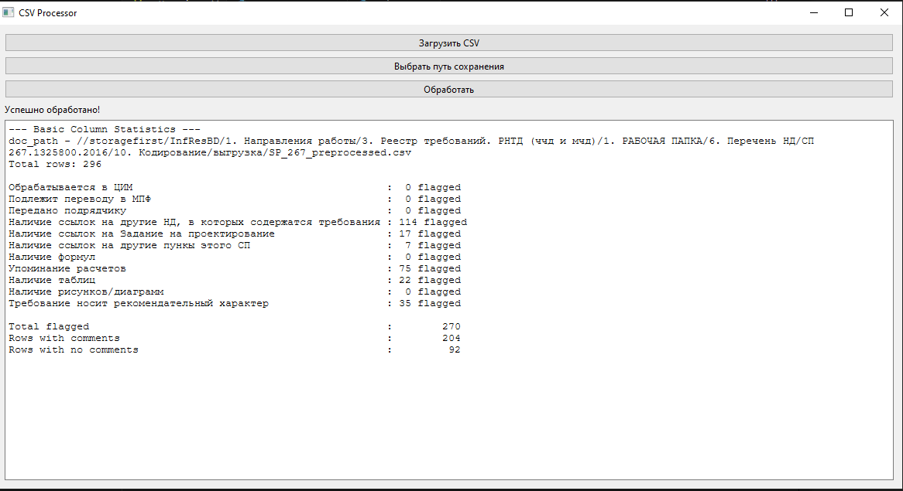

# Обработка нормативных требований

Программа предназначена для автоматической обработки текстов нормативных требований, с целью выявления **неоднозначных формулировок**.  

Входной формат — CSV-файл с текстами требований.  
На выходе — CSV с классификацией по наличию **регулярных признаков нечеткости и неопределенности** (например: «при необходимости», «следует учитывать» и т.д.).

---

## 🚀 Запуск

Убедитесь, что у вас установлен [**uv**](https://github.com/astral-sh/uv) — это быстрый Python-пакетный менеджер.

### Установка зависимостей:

```bash
uv pip install -r pyproject.toml
```

### Запуск основного скрипта:

```bash
uv run main.py
```

---

## 📦 Функции

- Принимает CSV-файл с текстами нормативных требований.
- Применяет регулярные выражения для определения потенциально **неоднозначных, условных или оценочных формулировок**.
- Добавляет в выходной CSV пометки или флаги, указывающие на наличие таких признаков.

